# 10)Databáze a jejich implementace v MySQL-**

**-co to je MySQL a k čemu a kde se užívá, jaký je to model databáze,
architektura jazyka, jak souvisí databázový systém se souborovým.
([[www.phpmyadmin.net](http://www.phpmyadmin.net/))- prakt.cast?**

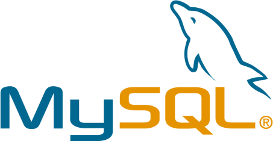

-**MySQL** je implementace relační databáze\*, která je plně
kompatibilní s SQL standardem ( standard = základy SQL jazyka,
uplatnitelné v kterémkoliv systému založeném na SQL).- Švédská firma
převzatá Oraclem\
\[ˈɒrəkəl\]

\*přesnější vysvětlení co jsou databáze obecně a relační model viz
předchozí maturitní otázka

-multiplatformní databáze- funguje na více operač. systémech.

Každý klient má vlákno, přes které je připojen a klade své
dotazy...důležité je i přihlášení a ověření autorizací
k úpravám(v struktuře mají různí uživatelé různé možnosti a prvomoci dle
nastavení správce)

-dvojí licencování- my si ji můžeme stáhnout v omezenější verzi (GPL-
general public license) a firma si jí musí koupit (komerční verze) a
dostane k ní nějaký základní support atd.

-MySQL databáze můžeme upravovat pomocí psaní příkazů například
v příkazovém řádku nebo pokud neovládáme SQL programovací jazyk, tak
použít například phpMyAdmin, což je uživatelské prostředí pro práci
s prostředím, kde klikáme na potřebné možnosti a nemusíme psát příkazy,
ty se vytvoří samy

-**K ČEMU?** -- Jako všechny ostatní databáze slouží k ukládání,
rychlému vyhledávání a využívání [strukturovaných
informací.

Výhody: - optimalizace datových struktur vzhledem k řešené problematice
- menší systémové nároky

Nevýhody: - aplikační závislost, rozsah jejího využívání dokazuje
převahu + nad -

-Kromě slučování a vybírání informací, MySQL také dělá statistiku (ke
zvýšení efektivnosti, třídí hodnoty, dělá indexy), phpMyAdmin dokáže pro
změnu například vytvořit i grafy zobrazující práci s daty v určitém
období - viz ukázka z internetu↓

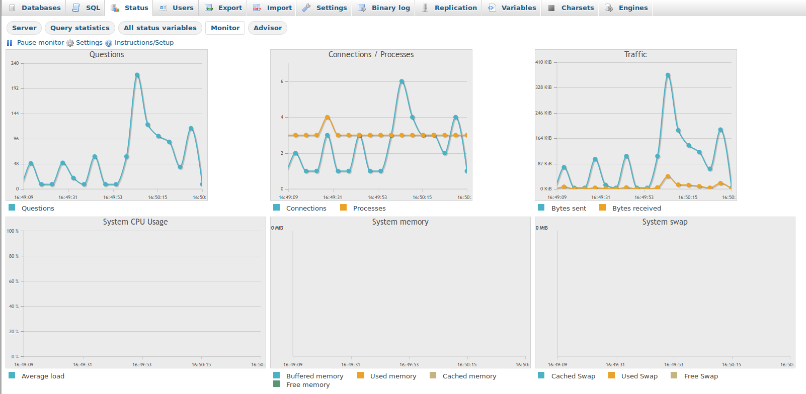

-**KDE?-** ve firmách, bankách, databáze zaměstnanců, zákazníků,
katastry, e-shopy, fb, finance...prostě skoro všude-fenomén moderní
doby...

-Databáze samotná a její servery jsou psány v programovacích jazycích C,
C++. Pokud s databází pracujeme přes phpMyAdmin (což je uživatelské
rozhraní k tomu určené), tak to je psáno v jazyce PHP (***Hypertext
Preprocessor***), který je vhodný pro dynamické internetové stránky.
S námi ale stále komunikuje na úrovni SQL (*Structured Query Language*),
ani ten ale nutně nepotřebujeme, při základních příkazech si postačíme
s klikáním a psaním do správných políček. Pokud píšeme příkazy/dotazy a
nebo vkládáme data do databáze jen v příkazovém řádku, tak tam se žádné
uživatelské rozhraní, které by nám pomohlo, nevyskytuje a ani PHP, tady
už musíme znát základy jazyka SQL.

## Co je SQL???

(aj.- *Structured Query Language*)

-je to dotazovací jazyk, který využíváme v relačních databázích k práci
s daty v tabulkách

-viz předchozí maturitní otázka: „(jedná se o dotazovací jazyk, tudíž
když pak informace hledáme nebo chceme získat komplexnější data
propojená z více tabulek, tak klademe dotazy v SQL a dostáváme na ně
odpovědi)"

-*SEQUEL* (Structured English Query Language)-předchůdce SQL, 70. léta-
výzkum relačních databází, snaha vytvořit programovací jazyk hodně
podobný aj

-píšeme středníky na konci řádků, \* označuje množinu všech položek
třeba z určité tabulky atd.

-SQL používají např. databáze MySQL, ORACLE\[ˈɒrəkəl\], MS SQL, SERVER,
SYBASE drobné odchylky syntaxu, drží ale stejný standard

[-Základní architektura SQL!

-vše je v angličtině (...překvapivě)

Indexování tabulek příkaz - **CREATE** index

(Index je uspořádaný seznam všech hodnot jednoho nebo více sloupců: -
rychlý přístupu k datům tabulek - přístupu do tabulek podle uspořádání -
viz KLÍČE - primární, unikátní... opět viz předchozí maturitní otázka)

-Existuje pár základních příkazů, které se používají neustále (k
manipulaci s daty - SELECT, UPDATE, INSERT, DELETE):

(dále existují příkazy pro definici dat: **CREATE** (vytvořit), ALTER
(změna sloupců), DROP (zahodit tabulku) ; a další skupiny...)

\--vytvoření báze dat (CREATE)

**mysql\> CREATE DATABASE \`Nazev\_databaze\`;** (tvorba databáze v SQL)

**mysql\> CREATE TABLE \`tabulka1\` (id int, jmeno varchar(222),
prijmeni varchar(222) );**

(kód SQL pro vznik tabulky, viz následující obrázky postup v prostředí)

vidíme, že jsme v SQL, vytváříme tabulku, její název, sloupečky a jejich
formáty popřípadě jejich max. hodnotu

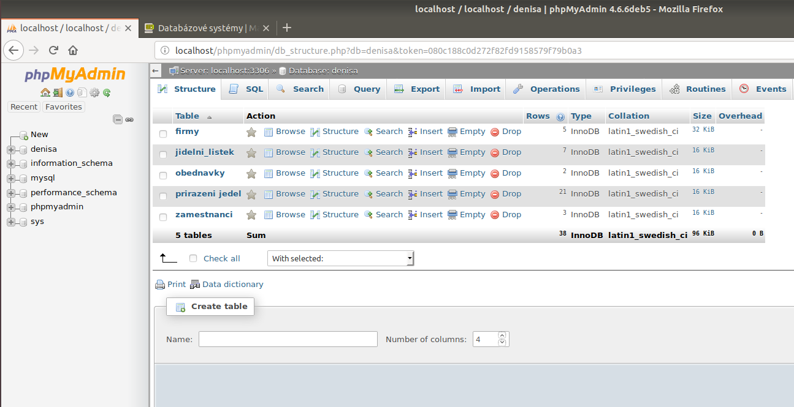

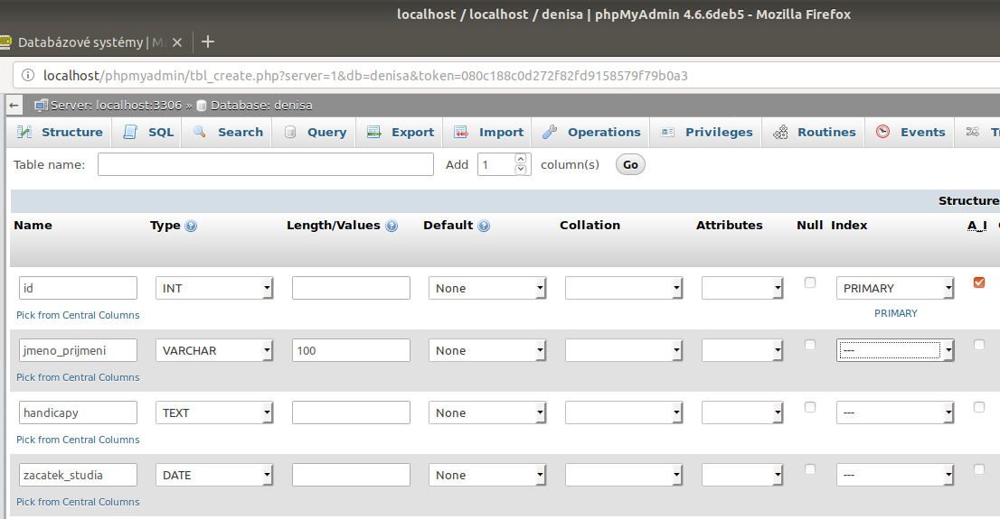

dole pod tabulkou, ať už zrovna zadáváme cokoliv se nám nabízí i možnost
nahlédnout jak vypadá kód SQL samotný (některé náležitosti zápisu můžeme
vynechat):

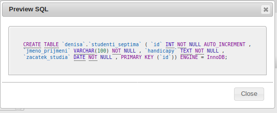

.

\--vkládání dat (INSERT)

-v phpMyAdmin jsem v jakékoliv tabulce, mohu jít do záložky „SQL" , tam
si vyberu možnost INSERT a prostředí už mi předepíše podle existujících
položek jakousi "formu":

**INSERT INTO \`zamestnanci\` (\`id\`, \`prijmeni\`, \`jmeno\`,
\`rok\_narozeni\`, \`fid\`) VALUES (\[value-1\], \[value-2\],
\[value-3\], \[value-4\], \[value-5\]);**

Doplníme si na toto (vpíšeme naše hodnoty):

**INSERT INTO \`zamestnanci\` (\`id\`, \`prijmeni\`, \`jmeno\`,
\`rok\_narozeni\`, \`fid\`) VALUES (4,\'Novak\',\'Martin\', 1950, 2);**

V této záložce se tímto způsobem také můžeme učit to, jak příkazy
vypadají, abychom později byli schopni psát si je už sami.

Když se objeví okénko Error, tak se z něj snažíme vyčíst, co je
špatně...což občas trvá, takže pozor na to, že názvy sloupečků a tabulek
mohou a nemusí být v \`těchto obrácených uvozovkách/ zpětných
čárkách\`...zatímco jméno či přímení, které vpisujeme do tabulky jsou
vždy v 'obyčejných jednoduchých uvozovkách'...středníky vám zde doplní
automaticky, ale v příkazovém řádku ne!

\--aktualizace dat (UPDATE)

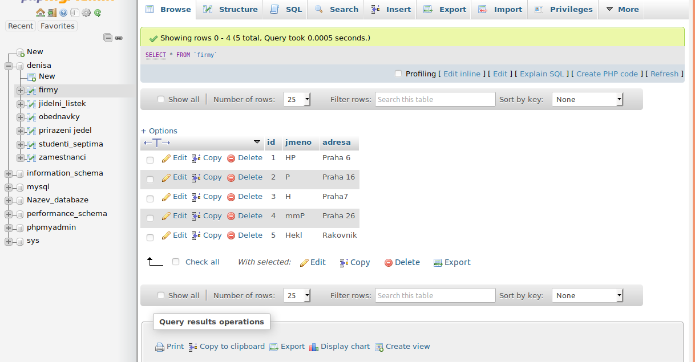

takže kliknu na edit a v kolonkách přepíši hodnoty, mohu zmenit nazev
firmy, jeji ID nebo adresu, vedle upravovaných položek vidím jejich
datové typy ( např. jméno firmy, které měním je varchar- kratší textový
typ), vše je celkem intuitivní, stačí se trochu zorientovat

Příkaz pro upravení dat by vypadal něják takhle:

**UPDATE \`firmy\` SET \`jmeno\`=\'APPLE\' WHERE \`id\` = 3;**

**="upravte firmy, nastavte jmeno Apple k radku s cislem 3"- 3 je klíč
díky kterému program ví, který řádek má ve sloupečku Jméno změnit**

\--rušení dat (DELETE)

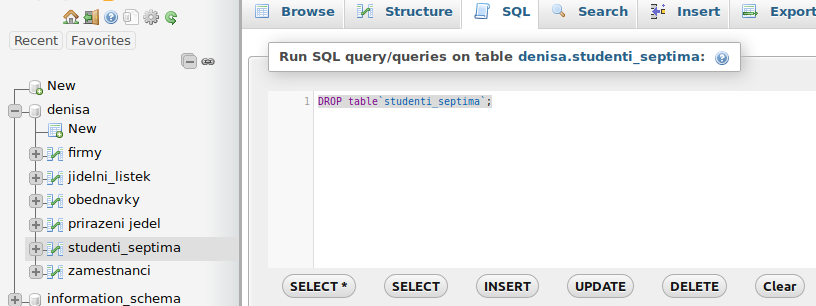

**smazání položky příkazem - např.: DELETE FROM \`firmy\` WHERE \`id\`=
4;**

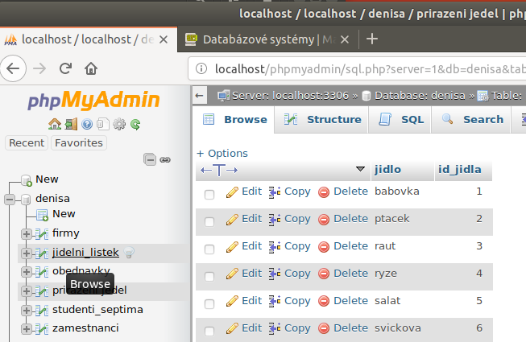

\--výběr z báze dat (SELECT)

-tady se konečně plně projeví relační databáze, propojení tabulek

-máme více tabulek a informace v nich jsou propojeny...neopakují se, jen
odkazují na už existující položky

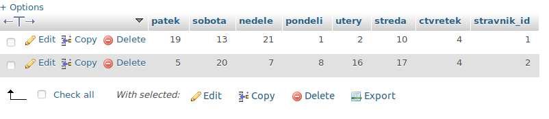

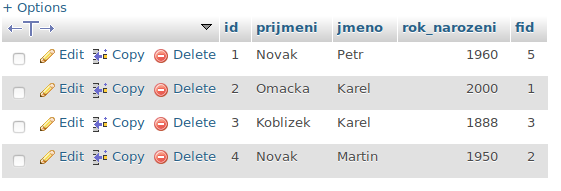

+seznam přiřazení jídel je o 2 obrázky zpět

Nyní tyto 3 tabulky využijeme:

**[SELECT](http://localhost/phpmyadmin/url.php?url=https://dev.mysql.com/doc/refman/5.5/en/select.html)
\* FROM \`obednavky\`;** - tento příkaz nám ukáže co je v objednávkách,
tedy tabulku kdo si co objednal

-vidíme, že v sobotu měl strávník s ID 1 jídlo 13 a strávník s ID 2
jídlo číslo 20

\- teď si představíme kuchařku v jídelně, která chce vědět, kolik čeho
má v sobotu vařit:

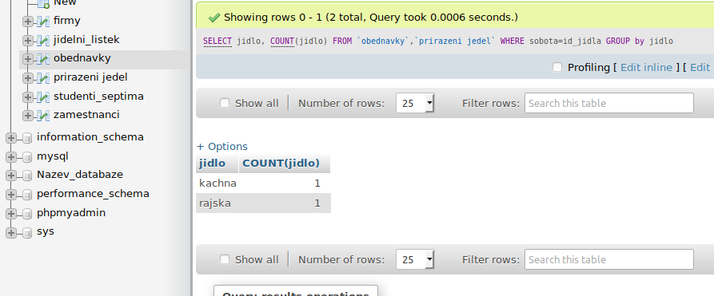

Příkaz, který vidíme výše, si můžeme přepsat do srozumitelných vět,
abychom věděli, co se tam děje: VYBER(select) jídlo a ZPOČÍTEJ(count)
ho. Potřebné informace si vezmi Z(from) tabulek „obednavky" a „přiřazení
jídel", KDE(where) číslo v „objednávkách" u soboty odpovídá číslu jídla
v „přiřazení jídel".

-obdobně mohu chtít vidět kdo si dal v sobotu tuhle kachnu a kdo
rajskou:

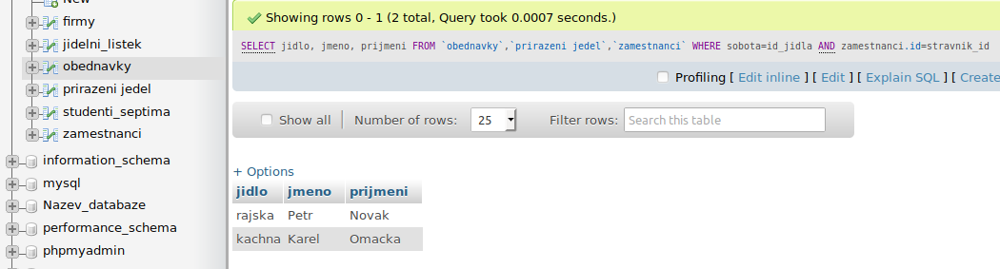

Opět: budeme chtít znát jídlo, jméno a příjmení - to jsou informace,
které nalezneme v tabulkách ...xy... KDE(where) číslo v „objednávkách" u
soboty odpovídá číslu jídla v „přiřazení jídel" AND (druhá doplňující
informace) číslo strávníka v „objednávky" odpovídá id člověka v
„zaměstnanci" tadáááá...Petr chce rajskou a Karel kachnu:DD

**BONUS:** (\--tvorba formulářů (FORMS)-nepatří do standardu)

Databázový systém se ukládá také do souborů, je souborově orientovaný.
Když s ní uživatel pracuje, používané tabulky zůstávají v paměti, čímž
se urychlí odezva systému, a když se systém vypíná, tak server uloží
všechny informace na disk do souborů, ale ty nemají strukturu stejnou
tomu, co vidíme v klientu či příkazovém řádku, existuje více způsobů u
databází, jakými svá data ukládají, ale pro běžného uživatele to není
podstatné. Složky jako takové mají hierarchickou/stromovou strukturu (ta
už je v databázích dávno překonána), ale kromě toho, že si do nich
databáze ukládá svá data, nemají moc společného. Složky neobsahují
relace, ani funkce či software, který by kontroloval dodržování datových
typů, zprostředkovával jejich úpravy, slučování a pokud nejsou na
sdíleném disku, tak většinou nejsou ani přístupné komukoliv kdekoliv,
popřípadě počítač nezjišťuje, jestli k nim máte povolený přístup.

A proč má MySQL ve znaku delfína?

Jeden ze spolutvůrců měl prostě delfíny rád, kvůli jejich inteligenci,
rychlosti a dobré povaze. Původně měl skákat z leva doprava, stejně jako
se píše, ale nakonec se rozhodli býti více originální a inovativní a
delfína otočit. Podle návrhů uživatelů bylo později vybráno pro delfína
jméno Sakila.

**Zdroje:**

[http://www.adaptic.cz/weby/programovani-aplikaci/](http://www.adaptic.cz/weby/programovani-aplikaci/)

[http://maturita-vyt.buchtic.net/10.php](http://maturita-vyt.buchtic.net/10.php)

[https://www.phpmyadmin.net/](https://www.phpmyadmin.net/)

[https://cs.wikipedia.org/wiki/PHP](https://cs.wikipedia.org/wiki/PHP)

[https://cs.wikipedia.org/wiki/PHP](https://cs.wikipedia.org/wiki/PHP)

[https://www.youtube.com/watch?v=FR4QIeZaPeM](https://www.youtube.com/watch?v=FR4QIeZaPeM)
[https://cs.wikipedia.org/wiki/SQL](https://cs.wikipedia.org/wiki/SQL)

[https://www.fi.muni.cz/usr/qdrasil/PV003\_SLIDE.PDF](https://www.fi.muni.cz/usr/qdrasil/PV003_SLIDE.PDF)

[https://infraadvisory.wordpress.com/2015/07/23/cpu-memory-stats-in-phpmyadmin/**](https://infraadvisory.wordpress.com/2015/07/23/cpu-memory-stats-in-phpmyadmin/)
