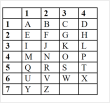

# Kryptografie
-   **Kryptologie** je věda, která se zabývá šifrováním ze všech úhlů
pohledu. Jejími hlavními disciplínami
jsou **kryptografie** a **kryptoanalýza**.

-   **Kryptografie** studuje šifrovací algoritmy, kryptografické
nástroje, hardwarové implementace šifrovacích algoritmů, kryptografické
protokoly apod.

-   **Kryptoanalýza** se zabývá luštěním šifer.V poslední době její
význam získává stále více na váze, díky odhalování teoretických slabin
běžně používaných šifer.

   Dále si definujme, co je to vlastně **šifrovací algoritmus**. Jedná
se o **proces transformace**, která převede **otevřený
text** (***plain-text***) na **šifrovaný text** (***cipher-text***) a
naopak. Při procesu **zašifrování** transformace probíhá pomocí **klíče
pro zašifrování**, při **odšifrování** pak analogicky pomocí **klíče pro
odšifrování**.

Šifrovací systém či kryptografický systém je takový systém, který
pozmění text na zašifrovanou zprávu tak, aby ji byla schopna přečíst jen
strana vysílací a přijímací. Hlavním cílem šifrovacího systému je
zabezpečit zprávu tak, aby byla pro všechny nepovolané osoby zcela
nečitelná. Tyto systémy se nejčastěji používají ve chvíli, když
potřebujeme data bezpečně uložit do počítačového souboru nebo pokud je
posíláme nezabezpečným kanálem, jako je např. internet. Existují tři
základní šifrovací systémy:

Transpoziční - písmena otevřeného textu nebo jejich jiné
zobrazení (např. číslicové nebo binární) přemisťujeme na jiná místa v
textu podle předem stanovených pravidel

Substituční - písmena nebo jejich jiné vyjádření
(číslicové nebo binární) jednoznačně zaměňujeme za jiná písmena a znaky

Kombinační - zahrnuje transpozici i substituci.

***Nejstarší šifrovací algoritmy***

   Počátky aplikace kryptologie, tak jak ji známe v současné době, se
datují až do roku **1900 př.n.l.**, kdy staří **Egypťané** používali pro
zápis citlivých dat atypické **hieroglyfy**.

   O rozvoj v oblasti šifrování se velkou měrou zasloužili
staří **Řekové**. Již kolem roku **350 př.n.l.** navrhl
vojevůdce **Aeneus Tacticus** okolo dvaceti šifrovacích klíčů
rozdělených do dvou skupin - ***transpoziční a
substituční***. Řecký historik **Plutarchos** zdokumentoval
vznik prvního **transpozičního šifrovacího systému** (písmena otevřeného
textu jsou přeskupována podle předem přesně určených pravidel),
zvaného **SKYTALA**, který používali sparťanští vojevůdci kolem
roku **500 př.n.l.**  Na dřevěnou hůl o přesném průměru se navinula
tenká kožená nebo pergamenová páska a napsala se na ni tajná zpráva.
Poté byla páska opět sejmuta z hole. Pouze osoba, která vlastnila
dřevěnou hůl o stejném průměru mohla přečíst šifrovanou zprávu. Při
pokusu o přečtení zprávy na holi o jiném průměru útočník získal pouze
nesmyslnou změť písmen.

   

  
Velkým objevem byla tzv. **Polybiova šifrovací
mřížka**. Abeceda byla vepsána do obdélníkové mřížky a každé písmeno
reprezentováno dvojicí čísel, na jejichž průsečíku řádku a sloupce se
dané písmeno nacházelo:

Při použití výše uvedené šifrovací mřížky by pak například
slovo **mrizka** v šifrované formě mělo podobu **415231723311**. Mřížka
však k reprezentaci písmen z otevřeného textu nemusela využívat pouze
číslice. V praxi se často používala také písmena či jiné „nestandardní"
symboly.

\_\_\_\_\_\_\_\_\_\_\_\_\_\_\_\_\_\_\_\_\_\_\_\_\_\_\_\_\_\_\_\_\_\_\_\_\_\_\_\_\_\_

   Slavnou se stala **Caesarova šifra**. Ta pochází z roku **50
př.n.l.** a jedná se o klasický **substituční systém** (znaky otevřeného
textu jsou nahrazovány jinými znaky, dle předem dohodnutého systému). 
Princip **Caesarovy šifry** bylo šifrování probíhalo tak, že se každý
znak nahradil znakem, který je v abecedě o **3 pozice** před ním.
Substituční klíč tedy vypadal takto:

 

**otevřený text:**  A  B  C  D  E  F   G  H  I   J  K 
L  M  N  O  P   Q  R  S  T  U  V  W  X  Y  Z

**zašifrovaný text:** X  Y  Z A  B  C   D  E  F G  H  I   J    K 
L  M  N  O  P  Q  R  S   T  U  V W

Morseovu abecedu vynalezl **Samuel Morse** v roce **1832**. První text
kódovaný pomocí morseovy abecedy a přenesený pomocí telegrafu byl:
„*What hath God wrought?"*. Stalo se tak v roce **1844**.

  V roce **1917** objevil **Gilbert Vernam**, zaměstnanec firmy AT&T,
nový druh proudové šifry, která je i v současné době považována za
bezpečnou a je známa pod názvem **Vernamova šifra**. K telegrafní pásce
přiložil ještě jednu, která obsahovala náhodně generované heslo.
Otevřený text se spolu s heslem načítají do šifrovaného textu, přičemž
je zde uplatněna binární operace **XOR**. V průběhu čtyřicátých let se
matematikům podařilo dokázat, že jde o bezpečný systém, což je hlavní
důvod, proč se s ním často setkáváme i v současné době.

***Enigma***

   **Enigmu** si nechal patentovat **18.2.1918** německý
inženýr **Arthur Scherbius** a v dubnu téhož roku ji nabídl německému
námořnictvu. V letech **1926** a **1928** německé námořnictvo používalo
upravenou verzi stroje Enigma. V roce **1928** se jeden
exemplář Enigmy dostal díky problémům při transportu do rukou polským
matematikům ve Varšavě. Ti přišli na to, že klávesnice je spojována
s kódovacím zařízením v abecedním pořadí. Na základě tohoto zjištění
sestrojili dekódovací zařízení **La Bombe**.

   Enigma svým vzhledem připomíná klasický **psací stroj**. Před její
klávesnicí je umístěno 26 konektorů, které slouží k propojení
jednotlivých písmen. Za klávesnicí se pak nachází **svítící deska**,
která obsahuje 26 písmen. Pomocí žárovek umístěných na této desce je
možno rozsvítit jakékoliv písmeno. Vlastní šifrovací mechanismus se
skládá z prostoru, na jehož stranách jsou **dvě kola**, mezi která se
vkládají další **tři kola**. Obě krajní kola mají 26 kontaktů, které
odpovídají jednotlivým písmenům abecedy. Kolo v levé části se
nazývá **reverzní kolo**. Tři **vnitřní kola** se vybírají z pěti
možných, verze s výběrem z osmi různých kol se používala pouze
v námořnictvu. Každé z vnitřních kol obsahovalo **vpravo 26
pružinových** a **vlevo stejný počet plochých konektorů** tak, aby do
sebe zapadaly.

   Vždy, když je stisknuto písmeno na klávesnici, tak se první kolo
otočí o jednu pozici. Poté, co se první okolo otočí 26x, otočí se druhé
a nakonec třetí. Dostáváme tak celkem 26x26x26, tj. **17576 různých
stavů**. Pro ztížení práce kryptoanalytikům byla délka zprávy omezena na
250 znaků, aby se nemohly opakovat sekvence, což by útočníkovi velice
pomohlo při luštění kódu.

***Rozdíly mezi symetrickou a asymetrickou šifrou***

   Začněme s popisem **symetrického šifrovacího systému**. Svůj název
získal dle šifrovacího klíče. Pro šifrování i dešifrování se totiž
používá **stejný šifrovací klíč**. Logicky je tedy klíč tedy nutné často
obměňovat. Tento problém se řeší generováním klíčů pro sezení, či lépe
z angličtiny tzv. **session key**. Odesilatel zprávy vygeneruje
šifrovací klíč, pomocí kterého zašifruje otevřený text. Šifrovanou verzi
poté veřejným kanálem pošle příjemci, který ji dešifruje pomocí stejného
šifrovacího klíče. Nutně zde však vyvstává další otázka: jak poslat
šifrovací klíč **tajně** a **bezpečně** příjemci? To je hlavní problém
symetrického šifrovacího sytému. Pokud by se třetí straně podařilo
získat šifrovací klíč, který je posílán pomocí tajného kanálu, dojde
k úniku informací. Výhodou symetrických šifrovacích algoritmů je jejich
rychlost. Mezi jednoduché symetrické šifrovací systémy patří například
i **Caesarova šifra**.

   **Asymetrický šifrovací systém** si dává za úkol zajistit bezpečnou
komunikaci pomocí neutajeného komunikačního kanálu a je též nazýván
systémem s **veřejným klíčem**. Ústředním pojmem je **jednocestná
funkce**, kterou definoval **R.Needham**:  jedná se o funkci **f:
x à y=f(x)**, u níž je jednoduché pro všechna **x** vypočítat **y**, ale
pro všechna **y** je spočetně nemožné získat **x**. Na základě toho je
generována dvojice klíčů: **veřejný** a **soukromý**. Veřejný klíč
určité osoby může vlastnit kdokoliv. Pomocí něho můžeme pouze zašifrovat
zprávu určenou určitému subjektu. Naproti tomu soukromý klíč si vlastník
musí chránit před zneužitím. Pomocí něho je možno dešifrovat přijaté
zprávy. Tím je zajištěno, že pouze vlastník soukromého klíče, jemuž je
šifrovaná zpráva  určena, je oprávněn přijatou zprávu dešifrovat.
Z hlediska bezpečnosti je teoreticky možné odvodit z veřejného klíče
klíč privátní, ale při dostatečné délce klíče je to v současné době
výpočetně nemožné;

## SYMETRICKÉ ŠIFROVACÍ SYSTÉMY

DES je prvním z veřejných kryptografických algoritmů. I přes řadu
v současné době známých chyb je velice populární a často používán.

   V roce **1973** vyhlásilo ministerstvo obchodu USA soutěž na
vytvoření šifrovacího standardu, který by dostatečně zabezpečil ochranu
důvěrných dat v informačních systémech. Vysokým nárokům však nevyhověl
žádný z navrhovaných algoritmů, a proto se soutěž konala
v roce **1974** znovu. Vítězem se stala firma **IBM**. Ta nevyvinula
zcela nový algoritmus, ale „pouze" zdokonalila svůj stávající šifrovací
algoritmus **Lucifer**, jenž byl vyvinut výzkumným týmem pod vedením
doktora **Tuchmana**. Šifrovací algoritmus DES prošel i bezpečnostním
hodnocením **National Security Agency** (též známé pod
zkratkou ***NSA***). V roce **1975** si jej firma IBM nechala
patentovat. Zároveň umožnila její bezplatné používání na území USA.
V březnu téhož roku byl zveřejněn šifrovací algoritmus DES.
V listopadu **1976** byl DES přijat jako šifrovací standard pro
zabezpečení neutajovaných dat v civilním a vládním sektoru
s předpokládanou délkou používání deset až patnáct let, s podmínkou, že
jeho bezpečnost bude každých pět let kontrolována. Díky masovému
rozšíření šifrovacího standardu DES však vznikl nový problém: jak ve
velkém měřítku nahradit tento šifrovací standard novějším a lepším? DES
se totiž stal neoficiálním mezinárodním standardem ve veřejném i
soukromém sektoru. Již v roce **1975** se začalo spekulovat o
bezpečnosti algoritmu DES. K prvním kritikům
patřili **Diffie** a **Hellman**. Ti kritizovali zejména nedostatečnou
délku šifrovacího klíče. Argumentovali tím, že k rekonstrukci
zašifrovaného textu stačí pouze vyzkoušet všechny možné kombinace
šifrovacích klíčů. Na základě jejich výhrad byla svolána konference,
která dospěla k závěru, že tento druh útoku v reálném čase bude možné
praktikovat až technologiemi vyvinutými po roce 1990.

   V roce **1997** vypsala agentura **RSA** kryptoanalytickou soutež,
v níž bylo cílem rozluštit text se známým začátkem a délkou šifrovacího
klíče 56 bitů. Po necelých pěti měsících byla šifra prolomena. Tímto
činem si **Rocke Versen**, vedoucí týmu **DES Challenge**, vydělal
10 000 dolarů a zároveň dokázal reálnou prolomitelnost šifrovacího
standardu DES. K dešifrování zprávy využil Internet - s pomocí týmu
luštitelů zkoušeli kombinace klíčů, dokud nebyla zpráva čitelná.

   Algoritmus šifruje 64 bitů otevřeného textu na 64 bitů šifry. Každý
osmý bit je však kontrolní, takže efektivní délka klíče je pouze 56
bitů. Kvůli této relativně nízké délce klíče byl přijat standard známý
pod názvem **Triple DES**(TDES, 3DES). Ten se od klasického DES liší
tím, že stejná data projdou algoritmem třikrát, čímž se zvýší efektivní
délka klíče.

-   CAST

   Název tohoto šifrovacího algoritmu vznikl na základě jmen jeho
tvůrců, kterými byli **C.Adams** a **S.Tavares**. Důvodem pro vznik
tohoto šifrovacího algoritmu byla situace na poli kryptografických
algoritmů v devadesátých letech. Šifrovací standard DES již nepůsobil
příliš důvěryhodně a kvalitní šifry byly finančně velice náročné. CAST
se v současné době velice často používá a stal se „neoficiálním
standardem".

-   IDEA

   Tento algoritmus byl vyvinut ve Švýcarsku jako alternativa
k šifrovacímu standardu DES. Jeho název je zkratkou
z ***International Data Encryption Algorithm***. Algoritmus byl
publikován v roce **1991**, původně však nesl název **IPES**. Jeho
autory byli **J.Messey** a **X.Lai**. IDEA je vylepšenou verzí
předchozího algoritmu **PES**, u kterého byla publikována metoda
prolomení.

##  ASYMETRICKÉ ŠIFROVACÍ SYSTÉMY

-   RSA
   Tento šifrovací systém získal svůj název dle počátečních písmen jmen
svých objevitelů, kterými
byli **R.L.Rivest**, **A.Shamir** a **L.Adleman**. Objev tohoto prvního
v praxi reálně použitelného šifrovacího systému s veřejným klíčem
oznámili **4.dubna 1977**. RSA představuje systém, který je relativně
bezpečný, ale značně pomalý. V hardwarové implementaci šifruje zhruba
tisíckrát pomaleji než DES a v softwarové pak stokrát.

   Veřejný klíč je generován s použitím velkých **prvočísel** a celá
bezpečnost RSA je založena na problému **faktorizace** velkých čísel na
prvočísla. Základem je výběr dvou velkých (velký=řádově stovky cifer)
prvočísel, která se vynásobí. Na základě jejich součinu je vygenerován
jak veřejný, tak privátní klíč. Bez znalosti původních prvočísel je
prakticky nemožné součin rozložit zpět na počáteční prvočísla.
Algoritmus RSA se též využívá při digitálním podpisu.

-   Digitální podpis*
   Digitální podpis je elektronickou obdobou běžného podpisu, jak jej
všichni známe z každodenního života. Digitální podpis umožňuje příjemci
ověřit totožnost odesilatele a zajišťuje mu integritu přenášené zprávy.

   Před odesláním se podepsaná zpráva zašifruje a zároveň se vygeneruje
krátký autentizační kód, který se nazývá haš. Výsledkem hašovací funkce
je posloupnost, která je mnohem kratší než odesílaná zpráva, ale přesně
odpovídá jejímu obsahu. Při modifikaci původní zprávy se nutně změní
také haš. Při ověřování neporušenosti zprávy se na straně příjemce
vygeneruje autentizační kód a ten se musí přesně shodovat s kódem
odesilatele. Pokud tomu tak není, je jisté, že se zpráva během přenosu
změnila. Kvalita celého digitálního podpisu tak velkou měrou závisí
právě na kvalitě jednocestné hašovací funkce.
