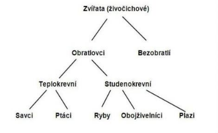

# Programování – datové struktury a pole

Objektově orientované programování (OOP)
-   **Princip**
    -   vytvoření obalu kolem spolu souvisejících proměnných a funkcí
    -   dědění společného
    -   snaha o napodobení reálného světa
-   **Výhody**
    -   znovupoužitelnost kódu (méně práce pro programátora)
    -   → DRY (don\'t repeat yourself), česky „suchý kód"
    -   snadnější teamová práce (například přes git, či jiný verzovací
        systém)
    -   logická struktura projektu
    
-   **Třída**  
    -   základní prvek OOP
    -   mohou **dědit** metody z jiné
    -   **šablona** pro tvorbu objektů **(nejedná se o objekt samotný!!!)**
    -   **metody** (mimo třídy funkce)
    -   **atributy** (mimo třídy proměnné)
    -   **konstruktor**
        -   speciální metoda třídy pro vytvoření instance (objektu)
        -   v dceřiných třídách lze přetížit (změnit jeho chování)
        -   alokuje prostředky (paměť)
    -   destruktor
        -   speciální metoda volaná při zániku objektu
        -   často uvolní paměť drženou objektem
        -   v některých jazycích k ní není přístup
-   **Objekt**
    -   vzniká ze třídy (zavoláním konstruktoru)
    -   atributy (vnitřní proměnné objektu)
    ```python
    class Clovek:
        def __init__(self, jmeno, vek):#konstruktor self._jmeno =
            jmeno
            self._vek = vek

            print("Vnikl objekt Clovek se jmenem", self._jmeno)

        def vypis_udaje(self):
            print(self._jmeno, self._vek)
        def __del__(self):  #destruktor
            print("Zanikl objekt Clovek se jmenem", self._jmeno)

    clovek = Clovek("Honza", 32)
    clovek.vypisUdaje()
    ```
výstup programu:


**Dědičnost**

-   Dceřiné objekty mají vlastnosti starších + své vlastní nové
    ```python
    class Clovek:
        def __init__(self, jmeno, vek):
            self._jmeno = jmeno
            self._vek = vek
        def vypis_udaje(self):
            print("------------------")
            print(self._jmeno, self._vek)

        class Student(Clovek):
            def __init__(self, jmeno, vek):
                super(Student, self).__init__(jmeno, vek)

        def vypisUdaje(self):
            super(Student, self).vypis_udaje()
            print("student")

    honza = Clovek("Honza", 32)
    honza.vypis_udaje()
    adam = Student("Adam", 21)
    adam.vypis_udaje()
    ```
    výstup programu:
    ```
    ------------------
    Honza 32
    ------------------
    Adam 21
    student
    ```
    Můžeme vidět, že instance třídy Student (Adam) se chová stejně jako
    instance třídy Clovek (Honza). Jediným rozdílem je vypsané slovo
    „student". Toho jsme docílili takzvaným „přetížením" metody
    vypisUdaje(). Můžeme si také všimnout, že v naší přetížené metodě stejně
    voláme původní verzi z třídy Clovek. K tomu jsme použili klíčové slovo
    super které odkazuje na rodičovskou třídu Student.

{width="6.8232in"
height="4.1539in"}Princip dědičnosti je velmi podobný jako například
dělení organismů v biologii.\
Všechny zvířata jsou tvořena buňkami, ale jen obratlovci mají obratle. Z
obratlovců si teplotu udržují jen teplokrevní. Teplokrevní mají obratle,
protože patří pod obratlovce a zároveň jsou tvořeni buňkami jako všichni
živočichové.\
Stejně tak v našem příkladu jsou všichni studenti zároveň lidé, ale ne
všichni lidé jsou studenti.

Některé jazyky nejsou takzvaně objektově orientované a tím pádem
postrádají třídy. Ty jsou v nich nahrazeny struktury (jazyk C) nebo
slovníky (pro logické uspořádání dat)

zdroje:\
<http://blog.thedigitalcatonline.com/blog/2014/05/19/method-overriding-in-python/>
<https://helloacm.com/constructor-and-destructor-in-python-classes/>\
<https://en.wikipedia.org/wiki/Object-oriented_programming>
