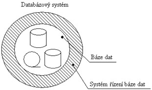
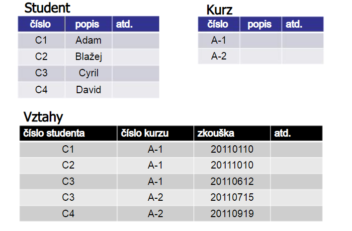
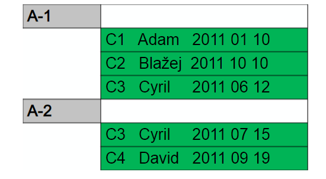
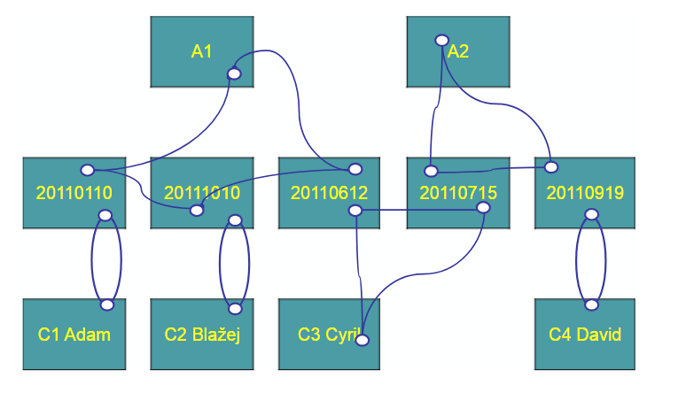

# 9) Principy databázových systémů

**-co to je, k čemu, proč se používá a kde, modely, relační databáze...
tabulka, sloupec, řádek, primární klíč, cizí klíč.**

-   **DATA** - informace o něčem, textová, obrázková či jiná podoba

-   **DATABÁZE** - systematické uspořádání dat do nějaké struktury (obsahuje
různá propojení, odkazy a filtry, které lze snadno a rychle využít)

-   **PROČ?** - pro možnost efektivní práce s informacemi a jejich snadnou
dostupnost

-   sbírání, uchování, vyhledání či zpracování dat ( info, údajů) za účelem
jejich poskytování a využití dále i z mnoha míst najednou (dále řazení
dle velikosti či chronologicky, tvorba tabulek a grafů)

data můžeme ukládat do databáze v phpMyAdmin- jednodušší operace hlavně
„klikací" záležitost, nebo je zapisovat v SQL programovacím jazyce do
příkazového řádku (jedná se o dotazovací jazyk, tudíž když pak informace
hledáme nebo chceme získat komplexnější data propojená z více tabulek,
tak klademe „otázky" v SQL a dostáváme na ně odpovědi)

-   **KDE?** - dnes se databáze využívají téměř všude... k tvorbě všech seznamů
zaměstnanců, katastrů vozidel či nemovitostí, online slovníků,
objednávek v e-shopech, seznamech zákazníků telefonních společností,
účetnictví, FB schraňující data o nás všech, atd. Také při programování
webových aplikací, kde usnadňují správu webu nebo podporují snadnou
interakci návštěvníka s obsahem stánky

**DATABÁZE NEJSOU JENOM DATA!**

  
-   tělesa uvnitř tvoří data- informace, které jsme do
databáze uložili

-   data „plavou" v jakési vlastní bázi dat - to jsou
struktury propojující data a určující jejich vzájemné závislosti,
umožňují jejich aktualizace a získávání určitých informací na základě
zadaných specifikací

    (souhrnně - 1.provazují data souborů, 2.oddělují data od popisů jejich
    struktur a programů, které je zpracovávají, 3.přistupují k datům přes
    programové vrstvy, 4. Umožňují vyhodnocování dat a přístup řady
    uživatelů naráz)

-   Systém řízení báze dat (SŘBD) to všechno „obaluje". Je to
software umožňující práci s databází, tvoří rozhraní mezi aplikačními
programy a uloženými daty.

    -   má na starosti: podporu různých datových modelů (hierarchický,
síťový, relační, objektový-druhy struktury dat-jejich propojení,
uložení, ještě později zmíněné)

    -   správu klíčů\*(- prostředek k rychlejšímu vyhledávání, něco jako
rejstřík v knize, připisuje neměnné hodnoty určitým datům)

    -   kontroluje autentizaci a autorizaci uživatelů k operacím s daty
(přihlásit se, zjistí, kdo jsi a přiřadí ti určitá omezení)

    -   dále **triggery** (spouštěče určité funkce, která má
proběhnout za určitých okolností), integritu dat (brání vkládání
nemožných nebo duplicitních hodnot klíčů atd.), **uložené
procedury** (často používané programy, uložené na serveru,
například makra jsou také uložené procedury) a profilování (statistika o
průběhu dotazů, průběhů a přístupech uživatelů) a pohledy
(views)-přednastavené selecty z tabulek, které jsou třeba z nepřístupné
tabulky či více tabulek...create view...virtuelní tabulka

## KLÍČE:

-   **primární** - jedinečný, nesmí obsahovat hodnotu NULL,
tabulka má pouze jeden (sloupec), schopen adresovat jakýkoliv řádek
tabulky- něco jako číslo popisné- v dané oblasti je unikátní

-   **unikátní** (méně omezený primární)] = jedinečná hodnota
ve sloupečku v tabulce, tabulka může obsahovat více takových sloupečků
k jiným účelům, může být i nulový (hodnota NULL), je vhodné ho mít
(pokud nemáme ani primární)...phpMyAdmin neumožňuje přístup do inline
editingu, pokud není přítomný klíč, který by jasně rozlišoval
jednotlivé řádky, v příkazovém řádku se může stát, že upravíme omylem
více podobných řádků, když nebudou mít tento klíč!

-  **cizí** - je primárním klíčem jiné tabulky, jakýsi odkaz
do jiné tabulky.(-Příklad: Student si objedná oběd na
středu-svíčkovou, té je v seznamu jídel přiřazen primární klíč 1 a
student má v tabulce studentů přiřazený primární klíč 26. V tabulce
zaznamenávající kdo si co objednal je potom v řádku studenta 26 ve
sloupečku středa jednička. V této tabulce objednávek je 26 cizím
klíčem, který odkazuje na tabulku studentů, kde můžeme najít jméno a
jiné údaje studenta...to samé platí pro 1, která je cízím klíčem
odkazujícím na tabulku jídel, kde se dozvíme, že je to svíčková.)

model databáze popsaný v příkladu, kde jedna tabulka efektivně
pomocí klíčů odkazuje na data v dalších tabulkách je **RELAČNÍ
MODEL** - je to v zásadě nejmladší (1970) a nejpoužívanější
model dnes. Je jednoduchý (co se týče struktury) a každá tabulka se
skládá z pojmenovaných sloupců a řádků.

    -   Pro sloupce nastavujeme datový typ, podle toho co tam chceme
    zapisovat (int, varchar, atd.) =\> SLOUPEC tedy obsahuje svým
    způsobem „monotóní data"- může se jednat o pořadová čísla řádků,
    roky narození osob v řádcích či jejich jména, ale vždy je to jeden
    druh informace se stanoveným vhodným datovým typem, který pak celý
    sloupec musí splňovat.

    -   Oproti tomu ŘÁDEK nemá jednotný typ, ale skládá se z vedle sebe
    ležících buněk z jednotlivých sloupců, informace v řádku mohou být
    různorodé - mohou obsahovat čísla, slova, názvy či celé texty - tyto
    informace se však vztahují a popisují jednu položku, třeba Karla
    nebo nějaký produkt, prostě je to ucelen. informace vztahující se
    k jednomu subjektu.

-   Relační MD může být pomalejší v důsledku mnohonásobných přístupů
    různými cestami najednou, ale zároveň šetří místo, protože stejnou
    informaci neuchovává duplicitně. (Př. Datab. syst. : MySQL,
    Oracle\[ˈɒrəkəl\] , Sybase, Microsoft Acess(SQL-Structured Query
    Language)).

  

↑-horní tabulky obsahují primární/ unikátní klíče, ty pak ve spodní
tabulce jsou klíči cizími a odkazují na „domovskou" tabulku

-   Nejstarší je **HIERARCHICKÝ MODEL** - dnes již značně
nepraktický a nepoužívaný, přirozené uspořádání do stromové struktury,
vztah 1:N - jedni rodiče mohou mít více dětí, ale jedno dítě má vždy 1
rodiče- nevýhoda je redundance dat- některé položky se musí opakovat
nebo nejde jejich závislost na ostatních dobře vyjádřit.

  

  

-   viz ukázka, Cyril jde na 2 zkoušky a musí být tedy v tabulce zapsán u
každé z nich ...také třeba složky v počítači s řadou podsložek mají
hierarchickou strukturu (ale nejedná se o databázi!)

Mezi Hierarchickým a relačním modelem vznikl ještě **SÍŤOVÝ MODEL**, ten je
vlastně zobecněním hierarch. modelu, ale obsahuje více konexí na ostatní
položky: ve vztahu: 1:N i M:N-např. jedna firma má více zaměstnanců ve
své databázi, ale jeden zaměstnanec zároveň je veden u více firem, kde
pracuje. - obtížnější realizace a úpravy dat, proto je také nepříliš
využívaný

*síťový model*

Spíše pro zajímavost:

-   Od 90.let existuje ještě **OBJEKTOVÝ MODEL** - ten neodděluje data od
    funkcí, je složen z objektů a ty mají různé atributy, tudíž do něj
    lze dobře ukládat data se složitou strukturou- text, obrázky, video,
    zvuk- jiný způsob ukládání i obsluhy

    -   OLAP (Online Analytical Processing) - databáze odpovídající na
        komplexní dotazy, práce s více dimenzemi, schopná uspořádat
        velké množství dat

**STRUČNÉ OPÁČKO:**

-   **Databáze = data ve struktuře**

-   **slouží k efektivní práci s informacemi**

-   **využívá se všude: katastry, seznamy, e-shopy, fb, ...**

-   **DTB se dělí na: Data, Báze dat (struktura, umožní
    přístup k datům), Systém řízení báze dat (software - práci s daty
    v dtb.)**

-   **Vztahy v modelech: 1:1, 1:N (hierarchický i síťový),
    N:M (síťový)...relační libovolné množství konexí**

-   **Řádek = celek různých info. vztahující se k jednomu
    subjektu**

-   **Sloupec = jeden druh informace, sdílející d. typ a
    druh obsahované informace**

-   **Klíče: Primární (nadřazený, jedinečný v tab.),
    Unikátní (jedin. ve sl.), Cizí (P. či Ú. klíč, ale nachází se v jiné
    tabulce jako odkaz na tu původní)**

-   **Nevýhody hierarch. a síť. modelů: těžko vyjádřitelné
    vztahy a náročná úprava, pomalost, redundance dat =\> Relační
    nejpoužívanějším m.**

**Zdroje:**[[https://cs.wikipedia.org/wiki/Syst%C3%A9m\_%C5%99%C3%ADzen%C3%AD\_b%C3%A1ze\_dat]](https://cs.wikipedia.org/wiki/Syst%C3%A9m_%C5%99%C3%ADzen%C3%AD_b%C3%A1ze_dat)

[[https://cs.wikipedia.org/wiki/Skriptovac%C3%AD\_jazyk]](https://cs.wikipedia.org/wiki/Skriptovac%C3%AD_jazyk)

[[https://is.mendelu.cz/eknihovna/opory/zobraz\_cast.pl?cast=20692]](https://is.mendelu.cz/eknihovna/opory/zobraz_cast.pl?cast=20692)

[[http://maturita-vyt.buchtic.net/10.php]](http://maturita-vyt.buchtic.net/10.php)

[[http://homel.vsb.cz/\~hom50/DATABAZE/SLBDBASE/DBS1ORGD.HTM]](http://homel.vsb.cz/~hom50/DATABAZE/SLBDBASE/DBS1ORGD.HTM)

[[https://www.youtube.com/watch?v=FR4QIeZaPeM]](https://www.youtube.com/watch?v=FR4QIeZaPeM)

[[http://www.adaptic.cz/weby/programovani-aplikaci/]](http://www.adaptic.cz/weby/programovani-aplikaci/)

[[https://cs.wikipedia.org/wiki/Index\_(datab%C3%A1ze)]](https://cs.wikipedia.org/wiki/Index_(datab%C3%A1ze))

[[https://slideplayer.cz/slide/2991970/]](https://slideplayer.cz/slide/2991970/)
