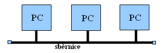
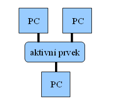
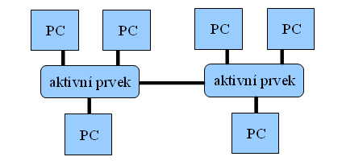

# 16. POČÍTAČOVÁ SÍŤ

-   Označení pro technické prostředky umožňující spojení, výměny
    informací a komunikací s ostatními počítači

-   60\. léta 20. století -- první pokusy s komunikaci počítačů

-   Sítě spojeny do internetu

-   Dělení: rozlehlosti a účelu, postavení uzlů, vlastnictví...

## Struktura síťí

-   **PEER TO PEER -- P2P** (rovný s rovným)

    -   Spojení několika zcela **samostatně fungujících,
        plnohodnotných** počítačů

    -   Všechny počítače na stejné úrovni

    -   Sdílení mohou být změněna či zrušena každým uživatelem

-   **KLIENT -- SERVER**

    -   Jeden či více počítačů (server) nadřazen jinému nebo více
        počítačům (klient -- stanice)

    -   Klient není **plnohodnotný**

    -   Server provádí různé činnosti:

        -   Print server -- sdílení tiskárny

        -   File server -- pevné disky umístěné na serveru obsahující
            uložené soubory z nichž můžeme čerpat nebo sdílet

        -   Proxy server -- sdílení internetu a zabezpečení připojení

        -   Mail server -- správa e-mailových schránek

        -   Aplikační server -- aplikace běžící na serveru (Na klientu
            nic neběží)

        -   Archivace dat

## Topologie sítí

-   **Sběrnicová (BUS)** - kabel prochází okolo všech počítačů,
    nerozvětvuje se (Ethernet s koaxiálním kabelem)

-   **Výhody**:

    -   Snadná realizace a snadné rozšíření jíž stávající sítě.

    -   Nevyžaduje tolik kabeláže jako např. hvězdicová topologie.

    -   Vhodná pro malé nebo dočasné sítě, které nevyžadují velké rychlosti
    přenosu.

-   **Nevýhody**:

    -   Nesnadné odstraňování závad.

    -   Omezená délka kabelu a také počtu stanic.

    -   Pokud nastane nějaký problém s kabelem, celá síť přestane fungovat.

    -   Výkon celé sítě rapidně klesá při větších počtech stanic nebo při
    velkém provozu

-   **Hvězdicová (STAR)** - všechny počítače připojeny k aktivnímu prvku
    (Ethernet s kroucenou dvojlinkou)

-   **Výhody**:

    -   Pokud selže jeden počítač nebo kabel nebude fungovat spojení pouze pro
    jednu stanici a ostatní stanice mohou vysílat i přijímat nadále

    -   Dobrá výkonnost v porovnání se sběrnicovou topologií. To souvisí s
    tím, že na jednom kabelu je připojen pouze jeden počítač, a tudíž
    jednak nedochází ke kolizím mezi pakety a také může současně přenášet
    data více počítačů.

    -   Snadno se nastavuje a rozšiřuje.

    -   Závady se dají snadno nalézt.

-   **Nevýhody**:

    -   U větších sítí vyžadováno velké množství kabelů -- ke každému počítači
    jeden.

    -   Potřeba extra hardware v porovnání se sběrnicovou topologií.

    -   V případě selhání centrálního síťového prvku přestane fungovat celá
    síť.

-   **Stromová (TREE)** - propojení více hvězdicových sítí (typicky v
    LAN)

stromová topologie

-   **Výhody**:

    -   Pokud selže jeden aktivní síťový prvek, ostatní části sítě mohou dále
    pokračovat.

    -   Snižuje se potřebné množství kabelů.

    -   Zvýšení bezpečnosti -- zvyšuje se obtížnost odposlouchávání síťové
    komunikace.

## Síťová rozlehlost

-   **PAN** (Personal Area Network)

    -   Nejmenší rozlehlost, používané pro propojení osobních
        elektronických zařízení (např.: telefon, notebook...)

    -   Cíl: odolnost proti rušení, nízká spotřeba, snadná konfigurace

    -   Bluetooth, IrDA, USB, WiFi

-   **LAN** (Local Area Network)

    -   Síť propojující koncové uzly elektronických zařízení (počítač,
        tiskárna...) v jedné firmě, škole nebo domácnosti

    -   Vzdálenost stovky metrů až kilometry

-   **MAN** (Metropolitan Area Network)

    -   Několik menších podsíťí spojené do jedné

    -   Propojené přes Wifi, optické vlákno

    -   Rozsah od několika bloků budov až po celá města

-   **WAN** (Wide Area Network)

    -   Spojení LAN a MAN

    -   Rozsah překračuje hranici města či státu

    -   Nejznámější -- INTERNET

***Podle Vlastnictví***

-   **Veřejná datová síť** (PDN)

    -   Provozována telekomunikačním operátorem za účelem poskytování
        služeb přenosu dat veřejnosti

    -   Data mohou být vysledována, pozměněna nebo přesměrována

-   **Privátní síť**

    -   Sít se stanoveným omezením pro zabezpečení

    -   Využívá speciální privátní IP adresy

    -   Přístup -- jen vybraná zařízení

-   **Virtuální Privátní síť** (VPN)

    -   Propojení počítačů přes veřejnou sít

    -   Vytváří bezpečné a šifrované připojení přes internet

    -   Data procházejí přes VPN tunely umožnují přes ověření skrýt IP
        adresu

##  Sítové zařízení
zařízení přijímající a vysílající data

**Aktivní sítové prvky**

-   **Repeater** (opakovač)

    -   Nejednodusšší, pracuje na nejnižší fyzické vrtsvě

    -   Přijímá zkreslený nebo jinak poškozený signál → vysílá opravený
        signál

-   **Hub** (rozbočovač)

    -   Důležitá součást s hvězdicovo topologií

    -   Pracuje na (první) fyzické vrstvě

    -   Zregenerovaní přijatého signálu a rozeslání na všechny porty

    -   „opakovač s více porty"

    -   Koncentrovaní jednotlivé přípojky sítových zařízení do jednoho
        místa

-   **Bridge** (most)

    -   Práce na (druhé) linkové vrtsvě → dovoluje v síti redukovat

    -   Propojení jednotlivých segmentů do více sítí s různými protokoly

    -   Nepouští přenášená data patřící do daného segmentu dále

    -   Rozhoduje (poslat nebo neposlat dále) na základě fyzické (MAC)
        adresy jednotlivých uzlů ukládající do RAM a podle pstupně
        přicházejících dat se učí topologiig sítě

    -   Nevýhody: mírné zpoždění

    -   Výhody: nemusí se konfigurovat, zmenšuje zatížení

-   **Switch** (přepínač)

    -   Práce na (druhé) linkové vrtsvě

    -   Rozdělení rozsáhlé sítě za účelem lepšího využívání přenosové
        kapacity sítě

    -   Funkce podobná HUBu s rozdílem, že Switch propojuje jen dvojici
        portů mající k dispozici plnou přenosovou rychlost

    -   Propojuje jen v místní síti

-   **Router** (směrovač)

    -   Práce na (třetí) sítové vrstvě

    -   Přesměrovává data do jiného segmentu

    -   Rozdíl

        -   SWITCH -- cesty propojující všechny města ve státě

        -   ROUTER -- hraniční přechody mezi jednotlivými státy

-   **Gateway** (brána)

    -   Práce na aplikační vrstvě

    -   Zajištění datové komunikace s různých typů sítí (jiný
        komunikační protokoly)

    -   Použití i při propojení sítě do Interenetu v protokolu TCP/IP

        -   Při zadávání IP adresy ručně je nutné zadat i tzv. výchozí
            bránu (adresa směrovače, kterým jste připojeni)

## Pasivní sítové prvky
strukturovaný po které se přenašejí data;
nevyždaují elektrické napájení

-   **Kroucená dvojlinka**

    -   Nejběžnější druh kabelu

    -   Tvořeny páry vodičů, které jsou zkroucené a následně výsledné
        páry jsou do sebe zakrouceny

    -   Přesnosvé rychlosti: 100Mb/s, 1Gb/s, 10Gb/s (dle kategorie)

<!-- -->

-   **Koaxiální kabel**

    -   Dnes se v LAN nepoužívá

-   **Optické vlákno** -- přenos vysokou rychlostí na velké vzdálenosti

## Princip fungování sítě

I.  Sítové vrstvy

každá vrstva řeší něco jiného, využívá služeb nižší vrstvy a
poskytuje služby vyšší

***TCP/IP*** (soubor pravidel komunikace/vrstev), využívá internet,
vychází z modelu ISO/OSI

-   **ISO/OSI** -- 7 vrstev (fyzická, linková, sítová, transportní,
    relační, prezentační, aplikační)

    -   **Fyzická**

        -   definuje všechny elektrické a fyzikální vlastnosti zařízení

        -   Obsahuje rozložení pinů, napětové úrovně a specifikuje
            vlastnosti kabelů; stanovuje způsob přenosu (jedničky a
            nuly)

        -   Funkce: Navazování a ukončování spojení s komunikačnm
            médiem. Spolupráce na efektivní rozložení všech zdrojů mezi
            uživateli.

    -   **Linková**

        -   Poskytuje spojení mezi sousednímy systémy

        -   Seřazuje přenášené rámce; Stará se o nastavení parametrů
            přenosu linky; oznamuje neopravitelné chyby

    -   **Sítová**

        -   Stará se o směrování v síti a sítové adresovní

        -   Poskytuje spojení mezi nesousedící systémy

    -   **Transportní**

        -   Přenos dat mezi koncové uzly

        -   Poskytování kvalitního přenosu požadující vyšší vrtvy

    -   **Relanční**

        -   Organizace a synchronizace spojení mezi spolupracujícími
            relančními vrstvami obou systémů a řízení výmenu dat mezi
            nimi

    -   **Prezenční**

        -   Transformování data do formy používající aplikace
            (šifrování, konvertováné, komprimace)

    -   **Aplikační**

        -   Poskytnout aplikacním spolupráci a přístup ke komunikačnímu
            systému (HTTP, HTTPS, FTP, SMTP, POP3, DNS, DHCP)

-   **TCP/IP** -- 4 vrstvy:

    -   **Vrstva sítového rozhraní** -- fyzická, PC komunikující pomocí
        MAC adresy nezávisle na OS

    -   **Sítová** -- protokol IP, zajišťování sítové adresaci pomocí OS

    -   **Transportní** -- protokol TCP, přenášení dat

    -   **Aplikační** -- sada protokolů spolupracující s jednotlivými
        aplikačními programy (http, HTTPS, FTP, SMTP, POP3, DNS, DHCP)

II. ***IP a Mac adresa***

-   **MAC adresa** -- jednoznačné označení každé sítové karty zadané při
    výrobě

-   **IP adresa**

    -   Každý PC komunikující pomocí protokolu TCP/IP

    -   Jednoznačná identifikace PC v síti (IPv4 a IPv6)

    -   IPv4 -- používá 32bitové adresy zapsané dekadicky po osmi
        bitech, (např. 192.168.0.1)

    -   IPv6 -- nahrazuje protokol IPv4, využívá 128bitové adresy (např.
        2001:0db8:85a3:08d3:1319:8a2e:0370:7334)

    -   **Veřejná** -- adresa viděna odkudkoli z internetu; přiděluje
        poskytovatel internetového připojení

    -   **Neveřejná** -- adresa viděné pouze uvnitř LAN sítě; může
        nastavit sám

    -   **Statická** -- Neměnná adresa přidělená ISP nebo správcem sítě

    -   **Dynamická** -- přidělená automaticky DHCP serverem, může být
        pokaždé jiná

**ISP** -- Internet service provider

**FTP** -- protokol pro přenos souborů mezi PC počítačové sítě, využívá
protokol TCP/IP

**HTTP** -- internetový protokol pro výměnu hypertextových dokumentů ve
formátu HTML

**HTTPS** -- nástavba http se zabezpečením a šifrováním (SSL, TLS)

**SMTP** -- internetový protokol určený pro přenos zpráv e-pošty
(e-mailů) mezi přepravci e-pošty

**POP3** -- internetový protokol, určený pro stahování emailů ze
vzdáleného serveru na klienta

**DHCP** -- protokol z TCP/IP nebo označení odpovídajícího DHCP serveru
či klienta. DHCP server přiděluje počítačům pomocí DHCP protokolu
zejména IP adresu, masku sítě, implicitní bránu a adresu DNS serveru.)

**DNS** -- systém doménových jmen, umožňuje vzájemné převody doménových
jmen a IP adres uzlů sítě
