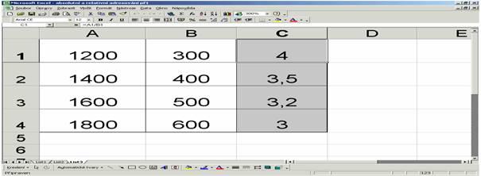
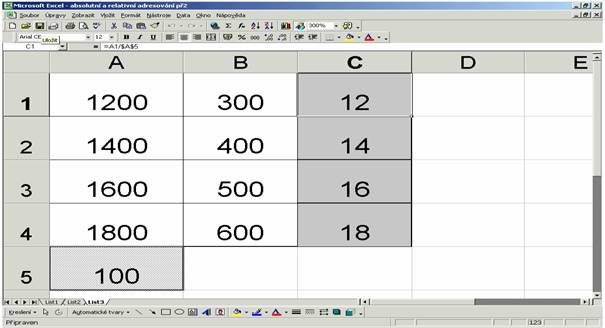
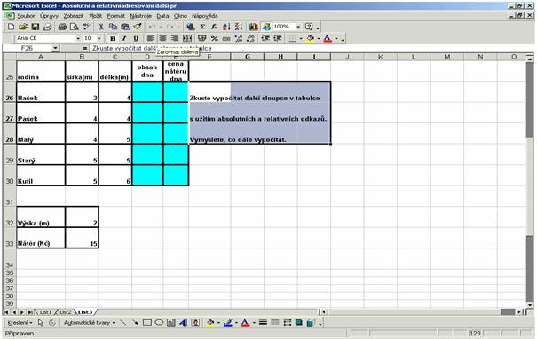

# Tabulkový kalkulátor

David Hruška

# 1) K čemu slouží tabulkový kalkulátor a jáké má vlastnosti?

Jedná se o aplikační program určený pro interaktivní provádění výpočtů v
rámci uživatelem definované tabulky. Tabulkové kalkulátory v sobě
kombinují vlastnosti uživatelsky příjemného prostředí pro návrh a tvorbu
tabulek a zároveň obsahují řadu funkcí, které jsou schopny provádět
elementární i velice složité statické či finanční výpočty.

# 2) Základní funkce tabulkového kalkulátoru.

## Matematické:  

**SUMA** - Sečtou se hodnoty.  
**USEKNOUT** - Odstraní desetinná místa z čísla.  
**ZAOKROUHLIT** - Funkce zaokrouhlí dané číslo na počet desetinných
    míst, které jsou dány druhým argumentem (číslice).

## Textové:  

**VELKÁ(UPPER)** - Funkce převede zdrojový text na velká písmena.  
**CONCATENATE** - Spojí řetězce znaků.  
**PROČISTIT (TRIM)** - Odstraní ze zdrojového textu přebytečné hodnoty
    před textem, za ním a mezi slovy. Pozor, funkce nefunguje na pevné
    mezery a jiné netisknutelné znaky.  

## Vyhledávající:  

**SVYHLEDAT (VLOOKUP)** - Funkce vyhledá hodnotu v prvním sloupci
    oblasti vyhledávání a vypíše hodnotu, která se nachází ve stejném
    řádku jako hledaná hodnota v sloupci určeném třetím atributem
    funkce.  
**POZVYHLEDAT (MATCH)** - Funkce vyhledá hodnotu v oblasti vyhledávání a
    vypíše číslo řádku, ve kterém se hodnota nachází.  
**INDEX (INDEX)** - Zobrazí se hodnota prvku, který je v zadaném řádku
    v poli.  

## Informační:  

**TYP (TYPE)** - Vrátí typ hodnoty zobrazené buňky a zobrazí příslušný
    kód.  
**JE.CHYBA (ISERROR)** - Zkontroluje, jestli je hodnota dané buňky
    chyba, a vrátí logickou hodnotu.  
**JE.TEXT (ISTEXT)** - Zkontroluje, jestli je hodnota dané buňky text,
    a vrátí logickou hodnotu.  
**ISFORMULA (ISFORMULA)** - Zkontroluje, jestli daná buňka obsahuje
    vzorec, a vrátí logickou hodnotu.  

## Logické:

**KDYŽ (IF)** - Funkce vyhodnotí logickou podmínku (např. A2\>4) a vrátí
    určenou podnotu podle toho, jestli je podmínka splněna (pravda) nebo
    ne (nepravda).

# 3) Jaké tabulkové kalkulátory znáte?

## MS Exel:  
Od firmy Microsoft pro operační systém Windows a počítače
Macintosh. Je součástí kancelářského balíčku OpenOffice. Už od verze 5 z
roku 1993 má dominantní postavení na trhu.  

## LibreOffice Calc:  
Je opensourcový, multiplatformní a mnohojazyčný
tabulkový procesor z balíku LibreOffice. Vznikl jako fork OpenOffice.org
Calcu, když se projekt LibreOffice odtrhl i s většinou komunity od
původního projektu OpenOffice.org. podporuje mnoho tabulkových formátů
od méně obvyklých až po například formáty svého největšího konkurenta,
MS Excel (.xls, .xlsx).  

## Pages:  
Od firmy Apple Inc. Je součástí iWork balíčku. Běží pouze na
operačním systému macOS a IOS. První verze vyšla v únoru 2005. Dokáže
importovat i jiné dokumenty, napřídklad PDF, EPUB a DOC formát.  

# 4) Co je to relativní a absolutní adresace buňek?

## Relativní adresa:  
Je odkaz přizpůsobující se nové pozici.  
## Relativní odkazy:  
Zatím jsme používali hlavně odkazy relativní.Přesto, že
jsme ve vzorcích používali skutečnou adresu buňky, tato adresa ve
skutečnosti udává relativní vzdálenost příslušné buňky od buňky se
vzorcem (pokud máme v buňce C1 vzorec =A1/B1, znamená to, že do této
buňky máme zapsat výsledek podílu buňky ležící o dvě buňky vlevo A1 a
buňky ležící o jednu buňku vlevo B1). Do buněk C2, C3 a C4 stačí tento
vzorec pouze nakopírovat (vzorec se přizpůsobí probíhající relaci).  
 

## Absolutní adresa:  
Je odkaz směřující na stále stejné buňky.  
## Absolutní odkazy:  
Pokud neřekneme Excelu, že se jedná o relativní adresování,
nevadí to, protože Excel s tímto automaticky počítá. Někdy však
potřebujeme do vzorce vložit hodnotu, která se nemění (konstantu). V
tomto případě je relativní adresování nemožné a my musíme použít
adresování absolutní (stačí pouze označit buňku, která má být konstantou
a stisknou klávesu F4)

 

V tomto příkladu chceme do buňky C1 vložit vzorec, který spočítá podíl
buněk na adresách A1 a A5 (do buňky C2 opět vzorec, který spočítá podíl
buněk na adresách A2 a opět A5 atd.). Na adrese A5 je konstanta,
použijeme absolutní adresování (označíme buňku a stiskneme F4). Vzorec
opět nakopíruje do buněk, kde je to třeba.

## PŘÍKLADY:  
Vytvoříme soubor Stavba v naší pracovní složce.
Představíme si následující situaci: několik rodin si staví bazén na svém
pozemku. Bazén má tvar kvádru. Výška bude konstantní (2 metry). Šířka a
délka bazénů je v následující tabulce. Spočteme sloupce obsah dna a cena
nátěru dna (víme, že 1m2 nátěru stojí 15 Kč):

 

Zdroje:
[*https://cs.wikipedia.org/wiki/IWork*](https://cs.wikipedia.org/wiki/IWork)

[*http://cehacko.wz.cz/Absolutni\_a\_relativni\_adresovani.htm*](http://cehacko.wz.cz/Absolutni_a_relativni_adresovani.htm)

[*http://adysmaturitaivt.blog.cz/1405/tabulkovy-kalkulator*](http://adysmaturitaivt.blog.cz/1405/tabulkovy-kalkulator)

[*https://cs.wikipedia.org/wiki/Apache\_OpenOffice*](https://cs.wikipedia.org/wiki/Apache_OpenOffice)

[*https://cs.wikipedia.org/wiki/LibreOffice\_Calc*](https://cs.wikipedia.org/wiki/LibreOffice_Calc)

[*https://en.wikipedia.org/wiki/Pages\_(word\_processor)*](https://en.wikipedia.org/wiki/Pages_(word_processor))

[*https://wikisofia.cz/wiki/Charakterizujte\_tabulkov%C3%BD\_procesor\_a\_jeho\_z%C3%A1kladn%C3%AD\_rysy\_a\_funkce.\_Uve%C4%8Fte\_typick%C3%A9\_situace,\_kdy\_je\_vhodn%C3%A9\_vyu%C5%BE%C3%ADt\_tabulkov%C3%BD\_procesor.\_Popi%C5%A1te\_pou%C5%BEit%C3%AD\_vzorc%C5%AF\_v\_tabulkov%C3%A9m\_procesoru*](https://wikisofia.cz/wiki/Charakterizujte_tabulkový_procesor_a_jeho_základní_rysy_a_funkce._Uveďte_typické_situace,_kdy_je_vhodné_využít_tabulkový_procesor._Popište_použití_vzorců_v_tabulkovém_procesoru).
