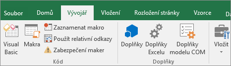
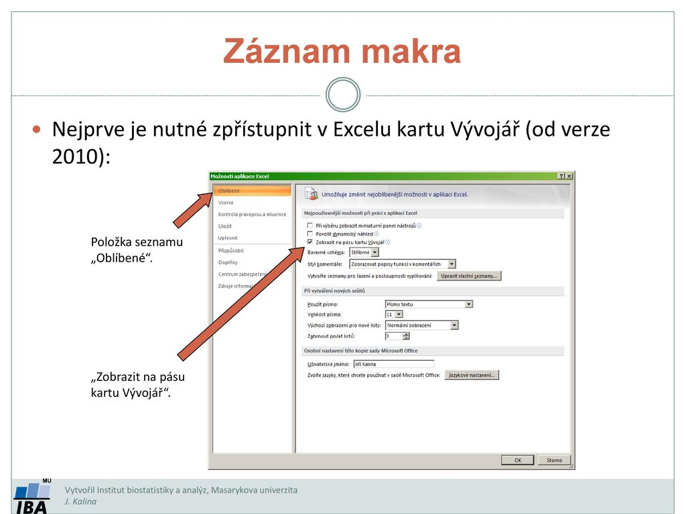
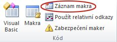
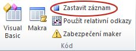
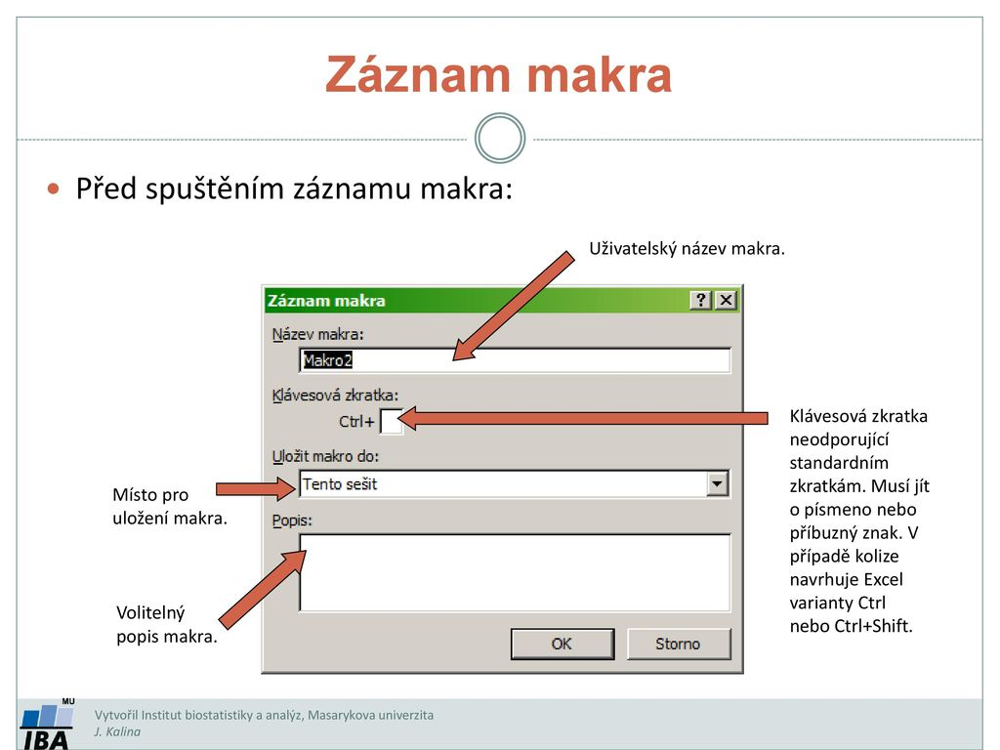
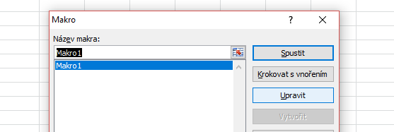
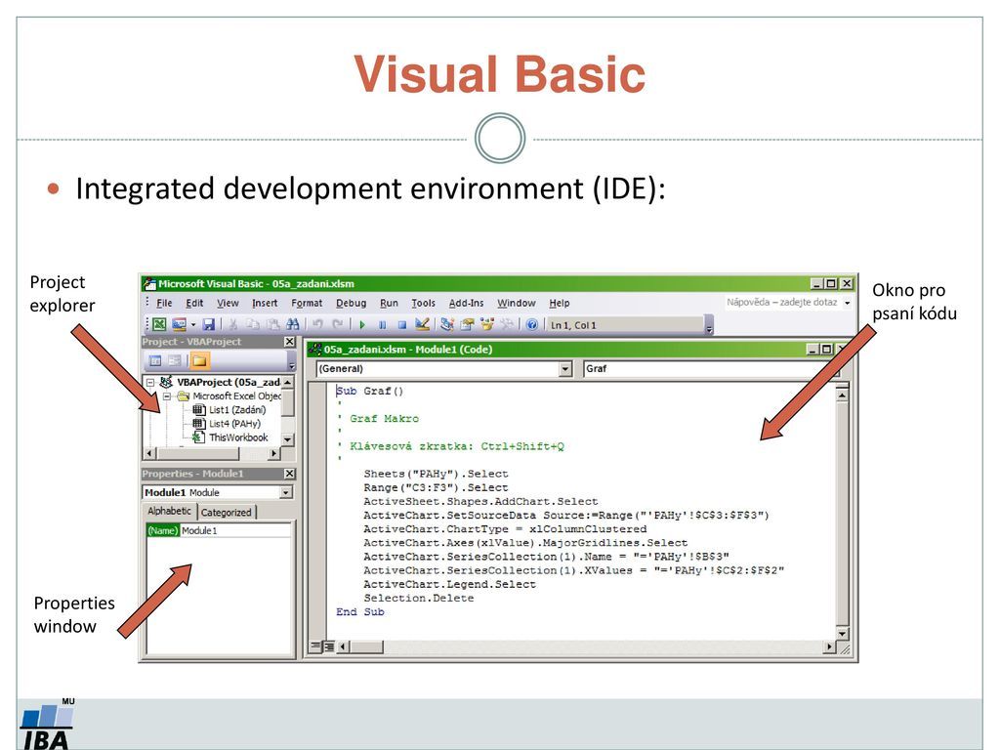

# 8\. Makra v MS Office

Makro je posloupnost příkazů, které můžeme vykonat jediným kliknutím či
klávesovou zkratkou.

Vytváření může probíhat dvěma způsoby:

-   Textový procesor zaznamená operace, které uživatel vykonává a uloží
    si je v podobě příkazů textového procesoru.

-   Posloupnost příkazů naprogramujeme v jazyce aplikace. V případě
    Wordu je jazykem Visual Basic for Application

Vytvořenou posloupnost pak můžeme přiřadit ikoně, položce v menu či
kombinaci kláves

**Užití:**

-   V programovaní jazyk jazyk C nebo C++

-   Nebo MS O.

**V programování:**

-   definice pravidla, jak bude vstupní posloupnost transformována na
    výstupní posloupnost

-   fragment kódu, kterému je přiřazen identifikační řetězec  

-   transformaci označujeme jako substituci nebo expanzi makra

**Makra bez parametrů (symbolická konstanta)**

-   píší se velkými písmeny

-   preprocesor nahradí symbolickou konstantu za skutečnou hodnotu (řetězec za řetězec)

-   pokud je délka konstanty delší než řádka, musí být na konci řádky ```\```

-   definice makra bez parametru:  
```
#define NÁZEV_MAKRA HODNOTA_MAKRA
```

-   zrušení makra:  
```
#undef NÁZEV_MAKRA
```

Makro bez parametrů:
```
#define NAME() foo()
```
**Makra bez parametrů - příklad:**
```
#define MAXIMUM 32767
#define PI 3.14
#define AND &&
#define POZDRAV "AHOJ"
#define DLOUHA "Toto je velmi dlouhá konstanta\
   a proto musí být rozdělena"
#define ERROR {printf("Nulou nelze dělit");}
#define POCET 10

void main(void)
{
   printf("%s", POZDRAV);
   if (a==0) ERROR;
}
```
**Makra s parametry (vkládané funkce)**

-   píší se malými písmeny

-   definice makra s parametrem:  
```#define NÁZEV_MAKRA(argument_1, argument_2) HODNOTA_MAKRA```

-   volání:  
```NÁZEV_MAKRA(parametr_1, parametr_2)```

-   preprocesor nahradí v programu řetězec  
```NÁZEV_MAKRA(parametr_1, parametr_2)``` řetězcem ```HODNOTA_MAKRA``` a argumenty v něm nahradí
    parametry

-   příklad:  
```#define soucin(a,b) printf("%d",(a)*(b));```  
    kdekoliv programu bude řetězec ```soucin(x+2,6)``` preprocesorem nahrazen
    řetězcem ```printf("%d",(x+2)*(6));```

Makro s parametry:  
```
#define NAME(a, b) foo(a, b)
#define MAX(a, b) (((a) < (b))? (a) : (b))
```

**Makra s parametry - příklad:**
```
#define sqr(x) ((x)*(x)) //x musí být v () -- jinak sqr(a+b)=a+b\*a+b
#define abs(a) ((a)<0 ? \ //pro pokračování na dalším řádku se píše \
(a)*(-1):a)
#define max(a) {int c=10; if (a>c) printf("a>10");}

void main(void)
{
    vysledek=sqr(4);
    max(20) //středník NESMÍ být, protože blok je ukončen v definici makra
}
```
**Makra vs. funkce**

-   **funkce potřebuje čas a paměť na alokaci parametrů**

-   **makro zaměňuje řetězec zeařetězec ještě před překladem --
    nepotřebuje alokaci argumentů**

-   **makra neumožňují typovou kontrolu ani použití rekurze**

V MS O.:

-   aplikace napsaná v programovacím jazyce Visual Basic for
    Applications (VBA)

-   sada příkazů, které je možné volat jedním výrazem

-   Automatizace rutinní činnosti v MS Office

-   nahrát, zapisovat

-   Př.:

    -   Odstraňování buněk A1 - A3 v Excelu

    -   Změna barev v buňkách B2 - B20

Historie MS maker

-   Možnost napsat vlastní funkci/makro je v Excelu od první verze v
    roce 1985.

-   Do roku 1993 (verze 5) byla makra zaznamenávána ve vlastním jazyce
    Excelu a ukládána jako soubory .xlm.

-   Starší verze maker jsou zpětně kompatibilní, ale není doporučné
    jejich použití z hlediska bezpečnosti.

-   Od verze 5 je možné makra zaznamenávat v jazyce Visual Basic.

-   Visual Basic byl vyvinut v roce 1991 kombinací staršího jazyka
    Basic (1964) a prostředí Ruby společnosti Tripod.

Jak na makro v MS O.

Kde se nachází

-   Makra a nástroje VBA najdete na kartě Vývojář, která je ve výchozím
    nastavení skrytá, takže prvním krokem je kartu zobrazit. 






Nahrávání makra

-   Klikněte ve skupině Kód na položku Záznam makra.

-   Volitelně můžete zadat Název makra, Klávesovou zkratku a Popis.
    Kliknutím na tlačítko OK spusťte záznam.



-   Proveďte akce, které chcete automatizovat.

-   Klikněte na Zastavit nahrávání.





Úprava

-   Ve skupině Kód na kartě Vývojář klikněte na tlačítko Makra, vyberte
    název makra a klikněte na tlačítko Upravit.




**VBA (Visual Basic for Applications)**

-   programovací jazyk od Microsoftu

-   balíček Microsoft Office

-   vytváření uživatelsky definovaných funkcí, automatizaci procesů,
    přístup k Windows API, kontrola aspektů hostující aplikace,
    manipulace s funkcemi uživatelského rozhraní a ostatní

-   dynamicky linkované knihovny (DLL)

-   jazyk není case sensitive - nerozlišuje malá a velká písmena

-   do kódu lze vepisovat komentáře uvozené apostrofem ‚

-   mezery a odsazení nemají vliv na interpretaci kódu

-   důležité je rozdělení řádků -- jedna funkce na jeden řádek,

-   více funkcí na řádku je možné spojit pomocí dvojtečky :

-   dlouhé řádky lze rozdělit pomocí kombinace , .

Makro můžeme i sami napsat když klikneme na ikonu vedle makra -- Visual
basic.



**metody a funkce**

-   Vytvořené funkce se automaticky přenáší do prostředí Excelu
    (konkrétního sešitu typu .xlsm, ke kterému je makro připojeno).

-   Funkce se od metody liší tím, že má definovánu nějakou návratovou
    hodnotu.

-   Makra nahraná pomocí záznamu maker v Excelu jsou automaticky
    považována za metody.

-   Funkce i metody se zadávají jako zdrojový kód psaný uživatelem nebo
    generovaný programem do okna kódu a uvozují se speciálními výrazy.

Funkce

-   Každá funkce je uvozena a uzavřena specifickými příkazy:
```
Function nazev_funkce(arg1, arg2,...) As typ

tělo funkce

End Function
```
-   Tělo funkce se skládá z operací, v nichž jsou pro výpočet využity proměnné specifikované na vstupu do funkce (argumenty z 1. řádku funkce) a funkce jazyka Visual Basic.

-   Návratová hodnota funkce je určena přiřazením hodnoty do názvu
```
funkce.nazev_funkce = arg1 + arg2
```
**metody**

-   Každá metoda je uvozena a uzavřena specifickými příkazy:
```
Sub nazev_metody(arg1, arg2,...)

tělo metody

End Sub
```
-   Tělo metody se skládá z operací, v nichž jsou pro výpočet využity proměnné specifikované na vstupu do metody a funkce jazyka VBA.

**Pár funkcí:**


Kde se setkáme s makry?

-   Microsoft Office, Open Office, jazyk C, C++, PHP, textový editor
    AmiPro,

Výhody/Nevýhody/Rizika

**Výhody**

-   Rychlejší než funkce

-   Urychlení práce

**Nevýhody**

-   Makro viry

    -   makra, která mají špatný účinek, nejdou odhalit, jsou součást
        souboru, nerozeznáš špatné makro od dobrého, kvůli nim skryt
        vývojář.

-   Slabší typová kontrola

-   vedlejší efekty při nesprávném použití

**Skript**

-   program nebo jeho fragment zapsaný v podobě kódu

-   souvislá série příkazů, naprogramovaný algoritmus vykonávající
    určitý úkol.

-   obvykle bývá uložen jako soubor.

Příklad:

Skript psaný v jazyce PHP, jehož úkolem je odeslat kontaktní formulář
emailem na určenou adresu, proběhne takto:

Uživatel odešle HTML formulář na příslušný skript → skript zjistí
hodnoty jednotlivých polí formuláře → skript vytvoří email, do něhož
vloží získané hodnoty → skript odešle email a ukončí se.

Skript

-   soubor

**Výhody skript jsou:**

-   Mohou být upraveny.

-   Fungují na pozadí, neovlivní je, co se právě děje na obrazovce, viz
    vyskočení nějaké tabulky, je nevyvede z míry.

-   Podporují pokročilé funkce jako čekání, sledování, zadávání textu
    atd.

-   Mohou spustit jiné programy pomocí příkazů.

**Nevýhody skript jsou:**

-   Nepodporují proměnné.

-   Pouze úhozy klávesnice

Makro

-   Posloupnost příkazů

**Výhody maker jsou:**

-   Makra mohou nahrávat úhozy a pohyby myší

-   Pro uživatele je snadné nahrávat a přehrávat.

**Nevýhody maker jsou:**

-   Neběží na pozadí, ovlivní ho třeba vyskočení tabulky o nějaké chybě.

-   Makra nelze upravit

Odkazy:

-   [[https://slideplayer.cz/slide/12517957/]{.underline}](https://slideplayer.cz/slide/12517957/)

-   [[https://support.office.com]{.underline}](https://support.office.com/)

-   [[https://exceltown.com]{.underline}](https://exceltown.com/)

-   [[https://office.lasakovi.com/excel/vba/ms-excel-vba-uvod/]{.underline}](https://office.lasakovi.com/excel/vba/ms-excel-vba-uvod/)

-   [[http://www.it.cas.cz/manual/vim/makro.htm]{.underline}](http://www.it.cas.cz/manual/vim/makro.htm)

-   [[https://www1.osu.cz/home/matejka/soft/data/macrov.htm]{.underline}](https://www1.osu.cz/home/matejka/soft/data/macrov.htm)

-   [[https://www3.rocketsoftware.com/bluezone/help/v30/bz/DISPLAY/MACRO/The\_Difference\_Between\_Macros\_and\_Scripts.htm]{.underline}](https://www3.rocketsoftware.com/bluezone/help/v30/bz/DISPLAY/MACRO/The_Difference_Between_Macros_and_Scripts.htm)

-   [[https://www.itnetwork.cz/cplusplus/cecko/pokrocile/programovani-v-jazyce-c-makra]{.underline}](https://www.itnetwork.cz/cplusplus/cecko/pokrocile/programovani-v-jazyce-c-makra)
